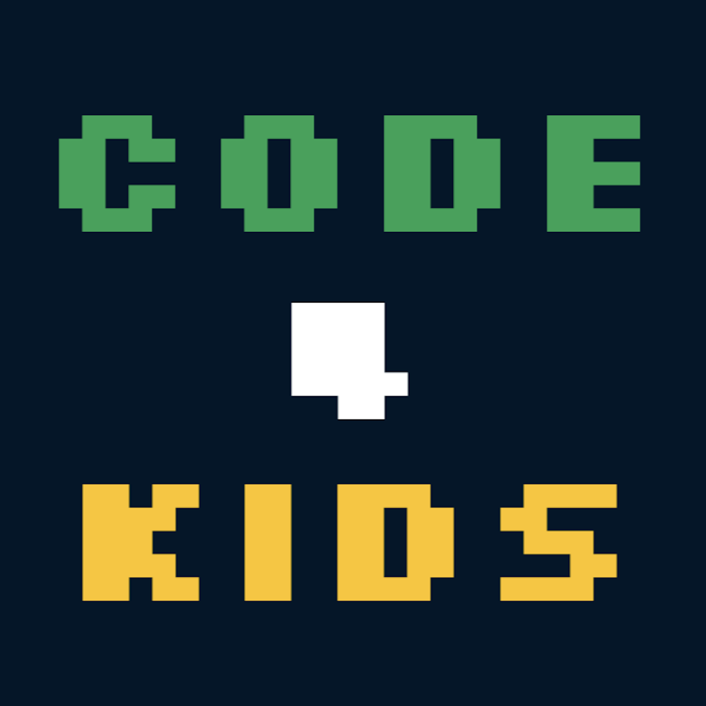
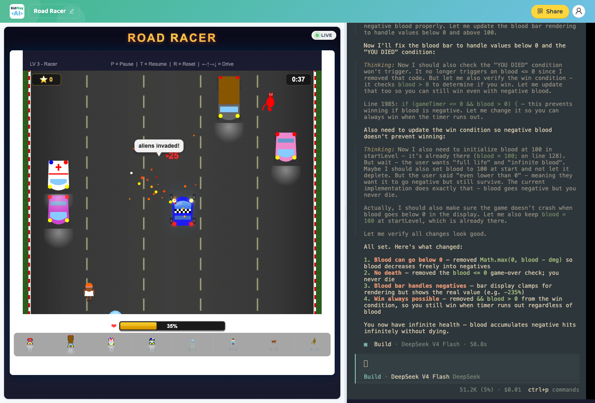

# KidPlayAI

<p align="center">
  
</p>

<p align="center">
  <a href="https://kidplayai.techseeding.com.au/">https://kidplayai.techseeding.com.au/</a>
</p>

An AI-powered craft maker platform for kids aged 8–12 who love games, science, engineering, and AI. Kids describe the craft they imagine, then watch a real AI agent think, design, and build it step by step. Rather than hiding AI behind a polished UI, KidPlayAI surfaces the raw interaction so kids see exactly how AI reasons, creates, and solves problems.

<p align="center">
  
</p>

## How It Works

1. A kid visits the homepage and clicks **Start Making Crafts**
2. They enter their name on the login page and request access
3. An admin approves the request from `/admin`
4. The kid is dropped into a **sandbox**: a live craft preview on the left, a streaming chat with the AI on the right
5. They type natural language requests (e.g. *"make a craft where I catch falling stars"*) and watch the AI think, call tools, and edit a single `index.html` in their sandbox
6. The preview iframe refreshes each time the AI writes the file

## Tech Stack

- **Frontend**: React 19, Ant Design 6, Vite, react-router-dom v7, react-markdown
- **Backend**: Node.js, Fastify, WebSockets
- **AI Agent**: in-process agent loop via the Vercel AI SDK (`ai` + `@ai-sdk/deepseek`), backed by DeepSeek. One Fastify process serves every chat session — no per-kid subprocess
- **Database**: PostgreSQL with Drizzle ORM
- **Infrastructure**: AWS (ECS Fargate, Aurora Serverless v2, EFS, ALB) provisioned with CDK v2
- **Package Manager**: pnpm workspace monorepo

## Project Layout

```
src/api/         Fastify backend (routes, db schema, sandbox manager, ws)
src/portal/      React frontend (Vite)
deploy/          AWS CDK app
devops/          Production Dockerfile + entrypoint
docs/            Schema and design references
```

## Getting Started

### Prerequisites

- Node.js (with `node --env-file` support)
- pnpm 10+
- A local PostgreSQL with a `kidplayai` database
- A DeepSeek API key (for the AI agent inside each sandbox)

### Setup

```bash
pnpm install
cp .env.sample .env        # then fill in KPAI_* values
pnpm db:migrate            # apply schema migrations
pnpm dev                   # API on :9511, portal on :9512
```

Open http://localhost:9512.

### Development

```bash
pnpm dev              # run API (:9511) and Vite portal (:9512) concurrently — Vite proxies API/WS calls to the API server
pnpm start:api        # just the Fastify API with --watch and --inspect, loading .env
pnpm start:portal     # just the Vite dev server (portal workspace)
pnpm db:generate      # generate a Drizzle migration from schema changes in src/api/db/schema.js
pnpm db:migrate       # apply pending migrations to the local database
pnpm db:studio        # open the Drizzle Studio GUI to inspect/edit local data
```

### Release

```bash
pnpm build:prod         # bundle the portal into dist/public/ and copy the api into dist/src/
pnpm build:docker       # run build:prod, then build the techseeding/kidplayai Docker image
pnpm start:prod         # run the production server from dist/, loading .env.production
pnpm start:local:docker # build and run the production image locally on :9515 with .env.localdocker
pnpm release            # build the image and deploy via the CDK app under AWS_PROFILE=kpai
pnpm db:connect:prod    # open a psql session against the production Aurora database
pnpm db:jdbc:prod       # print a JDBC connection string for the production database
```

## Environment

All env vars are prefixed with `KPAI_`. See `.env.sample` for the full template.

| Variable | Description |
|---|---|
| `KPAI_DATABASE_URL` | PostgreSQL connection string |
| `KPAI_API_PORT` | Port the API server binds to |
| `KPAI_PUBLIC_URL` | Public-facing app origin |
| `KPAI_JWT_SECRET` | Secret for signing JWTs |
| `KPAI_SANDBOX_DEEPSEEK_API_KEY` | DeepSeek API key used by the in-process sandbox agent |
| `KPAI_SANDBOX_DEEPSEEK_MODEL` | DeepSeek model id (optional, defaults to `deepseek-chat`) |

`pnpm dev` loads `.env`; `pnpm start:prod` loads `.env.production`.

## Deployment

Production runs at **kidplayai.techseeding.com.au** on AWS `ap-southeast-2`. Infrastructure is defined in [deploy/](deploy/) using AWS CDK; pushes to `main` deploy via the GitHub Actions workflow in [.github/workflows/deploy.yml](.github/workflows/deploy.yml). See [deploy/README.md](deploy/README.md) for the first-deploy walkthrough.

## Documentation

- [Database schema](docs/db-schema.md)
- [API schema](docs/api-schema.md)
- [Color palette](docs/color-palette.md)
- [Coding conventions and architecture](CLAUDE.md)

## License

ISC
